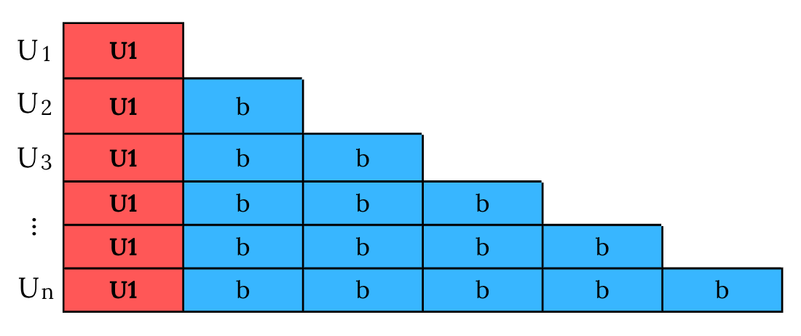
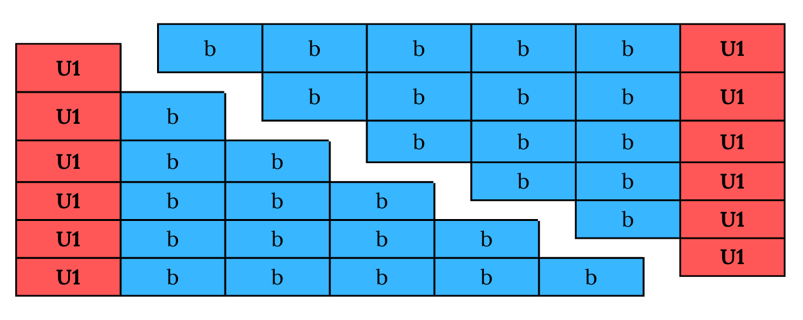
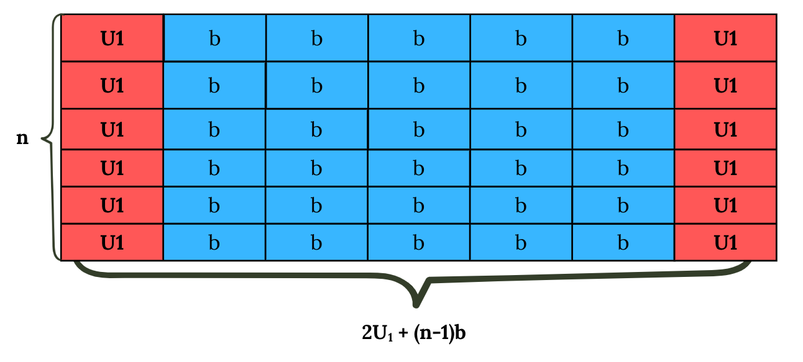

# Barisan dan Deret
**Barisan** (*sekuens*) secara umum adalah kumpulan objek (dalam kasus ini adalah bilangan) dalam urutan tertentu. Berbeda dengan himpunan, objek dalam barisan bisa muncul lebih dari sekali jika dalam urutan yang berbeda.

Suku sebuah barisan $a$ biasanya dinyatakan dalam bentuk $a_n$ yang artinya suku ke-$n$ barisan (atau juga $U_n$ yang lebih umum di sekolah). Dalam artikel ini, sebuah barisan dimulai dari $n=1$ sementara di beberapa literatur lain barisan mungkin dimulai dari $n=0$.

Sementara itu, **deret** (*partial sum* atau *series*) adalah penjumlahan suku pertama hingga suku ke-$n$ (*partial sum*) ataupun ke-$\infty$ (*series*).

$$
S_n = \sum_{i=1}^{n} U_n = U_1 + U_2 + ... + U_n
$$

$$
S_\infty = \sum_{i=1}^{\infty} U_n = U_1 + U_2 + U_3 + ...
$$

## Barisan dan Deret Aritmatika
Barisan aritmatika adalah barisan yang selisih antara suku bersebelahan tetap. Dengan kata lain, untuk setiap $n\geq1$ berlaku:

$$
U_{n+1} - U_n = b
$$

dengan suatu konstanta $b$ sehingga setiap suku barisan aritmatika bisa dinyatakan dalam bentuk:

$$
U_n = U_1 + (n-1)b
$$

Sementara itu deret aritmatika bisa dinyatakan dengan:

$$
S_n = \frac{n}{2}(U_1 + U_n)
$$

$$
S_n = \frac{n}{2}(2U_1 + (n-1)b)
$$

### Penurunan Rumus Deret aritmatika secara visual

Rumus deret aritmatika dapat dibuktikan secara visual dengan menganggap masing-masing suku sebagai persegi panjang dengan luas $U_n$ (panjang $U_n$ dan lebar 1) yang disusun berbaris.

Yang dicari, $S_n$, dalam kasus ini adalah jumlah luas seluruh persegi panjang di atas. Perhatikan ketika bangun datar di atas diduplikat, diputar, kemudian dipasangkan, kita akan mendapatkan persegi panjang dengan panjang $U_1 + (n-1)b$ dan lebar $n$

$S_n$ bisa didapatkan dengan menghitung setengah dari luas persegi panjang tersebut:

$$
S_n = \frac{1}{2}n(2U_1 + (n-1)b)
$$

### Penurunan Rumus Deret aritmatika secara aljabar

Rumus deret aritmatika juga dapat dibuktikan secara aljabar. Caranya sedikit mirip. Kali ini, yang diduplikat dan dibalik adalah urutan penjumlahan barisan.

\begin{align*}
S_n &=\quad U_1            &+&\quad(U_1 + b)      &+\quad...\quad+& \quad (U_1 + (n-2)b) &+& \quad (U_1 + (n-1)b)\\
S_n &=\quad(U_1 + (n-1)b) &+&\quad(U_1 + (n-2)b) &+\quad...\quad+& \quad (U_1 + b)      &+& \quad U_1
\end{align*}

Ketika deret dan deret yang dibalik dijumlahkan dengan setiap suku deret dijumlahkan dengan suku yang bersesuaian, akan diperoleh:

$$
S_n + S_n = (2U_1 + (n-1)b) + (2U_1 + (n-1)b) + ... + (2U_1 + (n-1)b) + (2U_1 + (n-1)b)
$$

Perhatikan bahwa setiap suku dari hasil penjumlahan menjadi $2U_1 + (n-1)b$ sehingga:

$$
2S_n = n(2U_1 + (n-1)b)
$$

$$
S_n = \frac{n}{2}(2U_1 + (n-1)b)
$$

## Barisan dan Deret Geometri
Barisan geometri adalah barisan yang rasio (hasil bagi) antara suku bersebelahan tetap. Dengan kata lain, untuk setiap $n\geq1$ berlaku:

$$
U_{n+1} = rU_n
$$

dengan suatu konstanta $r$ sehingga setiap suku barisan geometri bisa dinyatakan dalam bentuk:

$$
U_n = r^{n-1}U_1
$$

Sementara itu, deret aritmatika bisa dinyatakan dengan:

$$
S_n = \frac{r^n - 1}{r-1}U_1
$$

Jika r memenuhi $-1<r<1$, $r^n$ dan $U_n$ akan mendekati $0$ seiring $n$ mendekati $\infty$ sehingga deret tak hingga akan $S_\infty$ menjadi **konvergen** yakni mendekati suatu nilai:

$$
S_\infty = \frac{U_1}{1-r}
$$

### Penurunan Rumus Deret Geometri secara aljabar

Penurunan rumus deret geometri dapat dilakukan dengan cara yang mirip dengan rumus deret aritmatika (diduplikat, dimodifikasi, kemudian digabungkan). Namun, kali ini kita memodifikasi duplikat dengan mengalikannya dengan $r$ sehingga deret "tergeser" seperti berikut:

\begin{align*}
S_n  &= \quad U_1 &+&\quad rU_1 &+\quad...\quad+& \quad r^{n-2}U_1 &+& \quad r^{n-1}U_1 && {}\\
rS_n &= \quad {}  && \quad rU_1 &+\quad...\quad+& \quad r^{n-2}U_1 &+& \quad r^{n-1}U_1 &+& \quad r^nU_1
\end{align*}

Dengan ini, jika **dikurangkan**, yang tersisa hanyalah:

$$
rS_n - S_n = r^nU_1 - U_1
$$

Kemudian difaktorkan:

$$
(r-1)S_n = (r^n - 1)U_n
$$

Dan terakhir:

$$
S_n = \frac{r^n - 1}{r-1}U_1
$$

## Bonus!

**Problem:** Apa rumus umum dari deret di bawah.

$$
S_n = 1 + 11 + 111 + 1111 + ... + U_n
$$

**Jawaban:**

Karena selisih ataupun rasio antara suku bersebelahan tidak konstan, rumus deret aritmatika dan geometri tidak bisa langsung dipakai.

Kita akan mencari rumus umum $U_n$ terlebih dahulu. Perhatikan bahwa $U_n$ dapat dinyatakan sebagai **deret geometri** dengan rasio 10. Kita anggap saja suku dari deret $U_n$, sebagai $a_n$:

$$
U_n = 1 + 10 + 100 + 1000 + ... + a_n
$$

Dengan ini, $U_n$ bisa diungkapkan melalui rumu deret geometri:

$$
U_n = \frac{10^n-1}{10 - 1}1 = \frac{10^n-1}{9}
$$

Kemudian...

$$
U_n = \frac{1}{9}10^n - \frac{1}{9}
$$

$$
U_n = \frac{10}{9}10^{n-1} - \frac{1}{9}
$$

Jika diperhatikan, ternyata $U_n$ terdiri dari barisan geometri $\frac{10}{9}10^{n-1}$ dengan rasio 10 dan sebuah konstan $-\frac{1}{9}$. Dengan ini, kita bisa memisahkan $S_n$ menjadi: penjumlahan sebuah barisan geometri dan penjumlahan $-\frac{1}{9}$ yakni $-\frac{n}{9}$.

$$
S_n = \sum_{i=1}^{n}(\frac{10}{9}10^{n-1} - \frac{1}{9})
$$

$$
S_n = \sum_{i=1}^{n}\frac{10}{9}10^{n-1} - \sum_{i=1}^{n}\frac{1}{9}
$$

$$
S_n = \frac{10^n - 1}{10 - 1}\frac{10}{9} - \frac{n}{9}
$$

$$
S_n = \frac{(10^n - 1)10}{81} - \frac{n}{9}
$$

Selesai!
